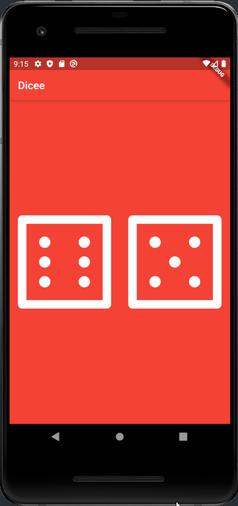

# DiceeFlutterApp
This App was Created to learn the basics of Flutter app development and the Dart programming language.
# Demo of Dicee App

# Things I Learned 
- Creating Flutter Projects
- Material UI and Creating Responsive Layouts
- Simple Dart Principles (Datatypes, Functions, State)
